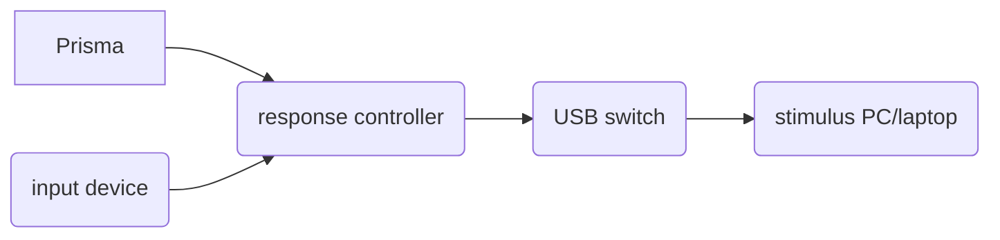

# Behavioural responses

ToNI has an array of MR-compatible input devices that can be used to collect manual responses from participants during a scan session. Our Current Designs Response System integrates trigger signals from the Prisma with the input devices through a response controller box. Output from the response controller is sent to a USB switch which can be set to connect either to the stimulus PC or a laptop. Here's a schematic of the system and images of the response controller and USB switch:

| response controller box | USB switch |
| ----------------------- | ---------- |
|  |  |
| ***TODO: change to real images!*** |  |

## Order of setup (super important!)
The order of plugging in the different cables and configuring the response controller is super important to ensure that the input devices and Prisma triggers are properly recognized by the stimulus PC or laptop. Follow these steps exactly as they are ordered:

